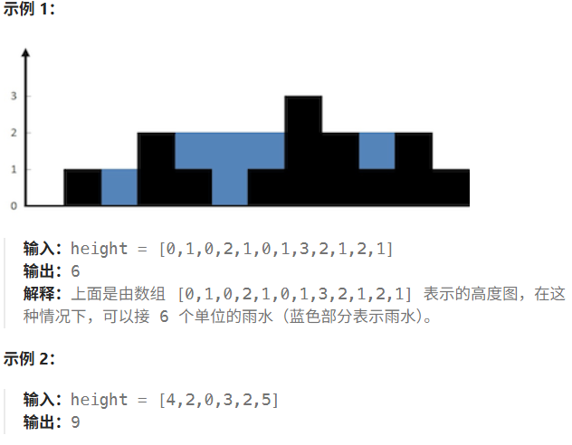
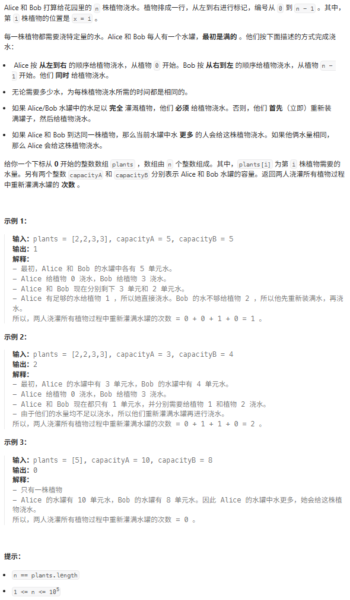

# 两数之和 II - 输入有序数组
https://leetcode.cn/problems/two-sum-ii-input-array-is-sorted/solution/san-shu-zhi-he-bu-hui-xie-xiang-xiang-sh-6wbq/

给你一个下标从 1 开始的整数数组 numbers ，该数组已按 非递减顺序排列  ，请你从数组中找出满足相加之和等于目标数 target 的两个数。如果设这两个数分别是 numbers[index1] 和 numbers[index2] ，则 1 <= index1 < index2 <= numbers.length 。

以长度为 2 的整数数组 [index1, index2] 的形式返回这两个整数的下标 index1 和 index2。

你可以假设每个输入 只对应唯一的答案 ，而且你 不可以 重复使用相同的元素。

你所设计的解决方案必须只使用常量级的额外空间。

 
示例 1：

输入：numbers = [2,7,11,15], target = 9
输出：[1,2]
解释：2 与 7 之和等于目标数 9 。因此 index1 = 1, index2 = 2 。返回 [1, 2] 。
示例 2：

输入：numbers = [2,3,4], target = 6
输出：[1,3]
解释：2 与 4 之和等于目标数 6 。因此 index1 = 1, index2 = 3 。返回 [1, 3] 。
示例 3：

输入：numbers = [-1,0], target = -1
输出：[1,2]
解释：-1 与 0 之和等于目标数 -1 。因此 index1 = 1, index2 = 2 。返回 [1, 2] 。
 

提示：

2 <= numbers.length <= 3 * 104
-1000 <= numbers[i] <= 1000
numbers 按 非递减顺序 排列
-1000 <= target <= 1000
仅存在一个有效答案

```c++
class Solution {
public:
    vector<int> twoSum(vector<int>& numbers, int target) {
        int left = 0, right = numbers.size() - 1;
        while (true) {
            int s = numbers[left] + numbers[right];
            if (s == target) {
                return {left + 1, right + 1}; // 题目要求下标从 1 开始
            }
            s > target ? right-- : left++;
        }
    }
};
```

# 三数之和 
https://leetcode.cn/problems/3sum/solution/shuang-zhi-zhen-xiang-bu-ming-bai-yi-ge-pno55/

给你一个整数数组 nums ，判断是否存在三元组 [nums[i], nums[j], nums[k]] 满足 i != j、i != k 且 j != k ，同时还满足 nums[i] + nums[j] + nums[k] == 0 。请你返回所有和为 0 且不重复的三元组。

注意：答案中不可以包含重复的三元组。

 

 

示例 1：

输入：nums = [-1,0,1,2,-1,-4]
输出：[[-1,-1,2],[-1,0,1]]
解释：
nums[0] + nums[1] + nums[2] = (-1) + 0 + 1 = 0 。
nums[1] + nums[2] + nums[4] = 0 + 1 + (-1) = 0 。
nums[0] + nums[3] + nums[4] = (-1) + 2 + (-1) = 0 。
不同的三元组是 [-1,0,1] 和 [-1,-1,2] 。
注意，输出的顺序和三元组的顺序并不重要。
示例 2：

输入：nums = [0,1,1]
输出：[]
解释：唯一可能的三元组和不为 0 。
示例 3：

输入：nums = [0,0,0]
输出：[[0,0,0]]
解释：唯一可能的三元组和为 0 。
 

提示：

3 <= nums.length <= 3000
-105 <= nums[i] <= 105

```c++
class Solution {
public:
    vector<vector<int>> threeSum(vector<int>& nums) {
        ranges::sort(nums);
        vector<vector<int>> ans;
        int n = nums.size();
        for (int i = 0; i < n - 2; i++) {
            int x = nums[i];
            if (i && x == nums[i - 1]) continue; // 跳过重复数字
            if (x + nums[i + 1] + nums[i + 2] > 0) break; // 优化一
            if (x + nums[n - 2] + nums[n - 1] < 0) continue; // 优化二
            int j = i + 1, k = n - 1;
            while (j < k) {
                int s = x + nums[j] + nums[k];
                if (s > 0) {
                    k--;
                } else if (s < 0) {
                    j++;
                } else { // 三数之和为 0
                    ans.push_back({x, nums[j], nums[k]});
                    for (j++; j < k && nums[j] == nums[j - 1]; j++); // 跳过重复数字
                    for (k--; k > j && nums[k] == nums[k + 1]; k--); // 跳过重复数字
                }
            }
        }
        return ans;
    }
};
```
# 统计和小于目标的下标对数目 、
https://leetcode.cn/problems/count-pairs-whose-sum-is-less-than-target/

给你一个下标从 0 开始长度为 n 的整数数组 nums 和一个整数 target ，请你返回满足 0 <= i < j < n 且 nums[i] + nums[j] < target 的下标对 (i, j) 的数目。
 

示例 1：

输入：nums = [-1,1,2,3,1], target = 2
输出：3
解释：总共有 3 个下标对满足题目描述：
- (0, 1) ，0 < 1 且 nums[0] + nums[1] = 0 < target
- (0, 2) ，0 < 2 且 nums[0] + nums[2] = 1 < target 
- (0, 4) ，0 < 4 且 nums[0] + nums[4] = 0 < target
注意 (0, 3) 不计入答案因为 nums[0] + nums[3] 不是严格小于 target 。
示例 2：

输入：nums = [-6,2,5,-2,-7,-1,3], target = -2
输出：10
解释：总共有 10 个下标对满足题目描述：
- (0, 1) ，0 < 1 且 nums[0] + nums[1] = -4 < target
- (0, 3) ，0 < 3 且 nums[0] + nums[3] = -8 < target
- (0, 4) ，0 < 4 且 nums[0] + nums[4] = -13 < target
- (0, 5) ，0 < 5 且 nums[0] + nums[5] = -7 < target
- (0, 6) ，0 < 6 且 nums[0] + nums[6] = -3 < target
- (1, 4) ，1 < 4 且 nums[1] + nums[4] = -5 < target
- (3, 4) ，3 < 4 且 nums[3] + nums[4] = -9 < target
- (3, 5) ，3 < 5 且 nums[3] + nums[5] = -3 < target
- (4, 5) ，4 < 5 且 nums[4] + nums[5] = -8 < target
- (4, 6) ，4 < 6 且 nums[4] + nums[6] = -4 < target
 

提示：

1 <= nums.length == n <= 50
-50 <= nums[i], target <= 50

```c++
class Solution {
public:
    int countPairs(vector<int>& nums, int target) {
        ranges::sort(nums);
        vector<vector<int>> ans;
        int i = 0;
        int count = 0;
        for (i = 0; i < nums.size() - 1; i ++)
        {
            int j = nums.size() - 1;
            while(i < j)
            {   // -1 1 1 2 3
                int s = nums[i] + nums[j];
                if (s < target)
                {
                    count = count + (j - i);
                    break;
                }
                j--;
            }
        }
        return count;
    }
};
```
```c++
class Solution {
public:
    int countPairs(vector<int>& nums, int target) {
        ranges::sort(nums);
        int ans = 0, left = 0, right = nums.size() - 1;
        while (left < right) {
            if (nums[left] + nums[right] < target) {
                ans += right - left;
                left++;
            } else {
                right--;
            }
        }
        return ans;
    }
};
```

# 最接近的三数之和

给你一个长度为 n 的整数数组 nums 和 一个目标值 target。请你从 nums 中选出三个在 不同下标位置 的整数，使它们的和与 target 最接近。

返回这三个数的和。

假定每组输入只存在恰好一个解。

 

示例 1：

输入：nums = [-1,2,1,-4], target = 1
输出：2
解释：与 target 最接近的和是 2 (-1 + 2 + 1 = 2)。
示例 2：

输入：nums = [0,0,0], target = 1
输出：0
解释：与 target 最接近的和是 0（0 + 0 + 0 = 0）。
 

提示：

3 <= nums.length <= 1000
-1000 <= nums[i] <= 1000
-104 <= target <= 104

```c++
class Solution {
public:
    int threeSumClosest(vector<int>& nums, int target) {
        ranges::sort(nums);
        // -4 -1 1 2   target = 1
        // reslut: -1 + 2 + 1 = 2
        int n = nums.size();
        int min_num = 1 << 31 - 1;
        for (int i = 0 ;i < n - 2;i++)
        {
            int j = i + 1;
            int k = n - 1;
            int x = nums[i];
            while(j < k)
            {
                int s = x + nums[j] + nums[k];
                if (abs(s - target) < abs(min_num - target))
                {
                    min_num = s;
                }
                if (s > target)
                {
                    k--;
                }
                else if(s < target)
                {
                    j++;
                }
                else{
                    min_num = s;
                    break;
                }
            }
        }
        return min_num;
    }
};
```

优化

```c++
class Solution {
public:
    int threeSumClosest(vector<int>& nums, int target) {
        ranges::sort(nums);

        int n = nums.size();
        int ans = INT_MAX / 2; // 除 2 防止减去一个负数溢出
        for (int i = 0; i < n - 2; i++) {
            int x = nums[i];
            // 优化
            if (i > 0 && x == nums[i - 1]) {
                continue;
            }

            // 优化
            int s = x + nums[i + 1] + nums[i + 2];
            if (s > target) { // 后面无论怎么选，选出的三数之和不会比 s 还小
                if (s - target < abs(ans - target)) {
                    ans = s;
                }
                break;
            }

            // 优化
            s = x + nums[n - 2] + nums[n - 1];
            if (s < target) { // x 加上后面任意两个数都不超过 s，所以下面的双指针就不需要跑了
                if (target - s < abs(ans - target)) {
                    ans = s;
                }
                continue;
            }

            // 双指针
            int j = i + 1, k = n - 1;
            while (j < k) {
                s = x + nums[j] + nums[k];
                if (s == target) {
                    return target;
                }
                if (abs(s - target) < abs(ans - target)) { // s 离 target 更近
                    ans = s;
                }
                if (s > target) {
                    k--;
                } else { // s < target
                    j++;
                }
            }
        }
        return ans;
    }
};
```

# 四数之和

给你一个由 n 个整数组成的数组 nums ，和一个目标值 target 。请你找出并返回满足下述全部条件且不重复的四元组 [nums[a], nums[b], nums[c], nums[d]] （若两个四元组元素一一对应，则认为两个四元组重复）：

0 <= a, b, c, d < n
a、b、c 和 d 互不相同
nums[a] + nums[b] + nums[c] + nums[d] == target
你可以按 任意顺序 返回答案 。

 

示例 1：

输入：nums = [1,0,-1,0,-2,2], target = 0
输出：[[-2,-1,1,2],[-2,0,0,2],[-1,0,0,1]]
示例 2：

输入：nums = [2,2,2,2,2], target = 8
输出：[[2,2,2,2]]
 

提示：

1 <= nums.length <= 200
-109 <= nums[i] <= 109
-109 <= target <= 109

```c++
class Solution {
public:
    vector<vector<int>> fourSum(vector<int>& nums, int target) {
        ranges::sort(nums);
        vector<vector<int>> ans;
        int n = nums.size();
        for (int a = 0; a < n - 3; a++) { // 枚举第一个数
            long long x = nums[a]; // 使用 long long 避免溢出
            if (a > 0 && x == nums[a - 1]) continue; // 跳过重复数字
            if (x + nums[a + 1] + nums[a + 2] + nums[a + 3] > target) break; // 优化一
            if (x + nums[n - 3] + nums[n - 2] + nums[n - 1] < target) continue; // 优化二
            for (int b = a + 1; b < n - 2; b++) { // 枚举第二个数
                long long y = nums[b];
                if (b > a + 1 && y == nums[b - 1]) continue; // 跳过重复数字
                if (x + y + nums[b + 1] + nums[b + 2] > target) break; // 优化一
                if (x + y + nums[n - 2] + nums[n - 1] < target) continue; // 优化二
                int c = b + 1, d = n - 1;
                while (c < d) { // 双指针枚举第三个数和第四个数
                    long long s = x + y + nums[c] + nums[d]; // 四数之和
                    if (s > target) d--;
                    else if (s < target) c++;
                    else { // s == target
                        ans.push_back({(int) x, (int) y, nums[c], nums[d]});
                        for (c++; c < d && nums[c] == nums[c - 1]; c++); // 跳过重复数字
                        for (d--; d > c && nums[d] == nums[d + 1]; d--); // 跳过重复数字
                    }
                }
            }
        }
        return ans;
    }
};
```

# 有效三角形的个数

给定一个包含非负整数的数组 nums ，返回其中可以组成三角形三条边的三元组个数。

 

示例 1:

输入: nums = [2,2,3,4]
输出: 3
解释:有效的组合是: 
2,3,4 (使用第一个 2)
2,3,4 (使用第二个 2)
2,2,3
示例 2:

输入: nums = [4,2,3,4]
输出: 4
 

提示:

1 <= nums.length <= 1000
0 <= nums[i] <= 1000

```c++
class Solution {
public:
    int triangleNumber(vector<int>& nums) {
        ranges::sort(nums);
        int ans = 0;
        for (int k = 2; k < nums.size(); k++) {
            int c = nums[k];
            int i = 0; // a=nums[i]
            int j = k - 1; // b=nums[j]
            while (i < j) {
                if (nums[i] + nums[j] > c) {
                    // 由于 nums 已经从小到大排序
                    // nums[i]+nums[j] > c 同时意味着：
                    // nums[i+1]+nums[j] > c
                    // nums[i+2]+nums[j] > c
                    // ...
                    // nums[j-1]+nums[j] > c
                    // 从 i 到 j-1 一共 j-i 个
                    ans += j - i;
                    j--;
                } else {
                    // 由于 nums 已经从小到大排序
                    // nums[i]+nums[j] <= c 同时意味着
                    // nums[i]+nums[j-1] <= c
                    // ...
                    // nums[i]+nums[i+1] <= c
                    // 所以在后续的内层循环中，nums[i] 不可能作为三角形的边长，没有用了
                    i++;
                }
            }
        }
        return ans;
    }
};
```
三数之和、四数之和、最接近的三数之和等问题的都是通过循环枚举第一个数（四数之和需要两层循环枚举前两个数），然后通过双指针枚举后面两个数(转化为了两数之和)来解决的。有效三角形的个数也是同样的思路。

# 优化思路

- 消除重复元素的影响：如果数组中存在重复元素，可能会导致重复的三元组被计数多次。可以通过排序数组并跳过重复元素来避免这种情况。
- 剪枝优化：在双指针的过程中，如果全局最小(num[0]+num[1]+num[2])的三数之和已经大于目标值，那么后续的组合也不可能满足条件，可以提前结束循环。如果局部最大(num[0]+num[n-2]+num[n-1])的三数之和已经小于目标值，那么当前的组合也不可能满足条件，可以直接移动左指针。

## exercise

# 盛水最多的容器

https://leetcode.cn/problems/container-with-most-water/description/

给定一个长度为 n 的整数数组 height 。有 n 条垂线，第 i 条线的两个端点是 (i, 0) 和 (i, height[i]) 。

找出其中的两条线，使得它们与 x 轴共同构成的容器可以容纳最多的水。

返回容器可以储存的最大水量。

说明：你不能倾斜容器

```c++
class Solution {
public:
    int maxArea(vector<int>& height) {
        int i = 0;
        int j = height.size() - 1;
        int max_c = 0;
        while(i < j){
            max_c = max(max_c,min(height[i],height[j]) * (j - i));
            if (height[j] < height[i]){
                j--;
            }
            else{
                i++;
            }
        }
        return max_c;
    }
};

class Solution {
public:
    int maxArea(vector<int>& height) {
        int ans = 0, left = 0, right = height.size() - 1;
        while (left < right) {
            int area = (right - left) * min(height[left], height[right]);
            ans = max(ans, area);
            // 如果 height[left] 更矮，则 height[left] 与右边的任意垂线都无法组成一个比 ans 更大的面积
            // 如果 height[right] 更矮，则 height[right] 与左边的任意垂线都无法组成一个比 ans 更大的面积
            height[left] < height[right] ? left++ : right--;
        }
        return ans;
    }
};
```

# 接雨水

https://leetcode.cn/problems/trapping-rain-water/description/

给定 n 个非负整数表示每个宽度为 1 的柱子的高度图，计算按此排列的柱子，下雨之后能接多少雨水。



提示

- n == height.length
- 1 <= n <= 2 * 104
- 0 <= height[i] <= 105

## 前后缀分解

```c++
class Solution {
public:
    int trap(vector<int>& height) {
        int size = height.size();
        vector<int> left_max(size);
        vector<int> right_max(size);
        left_max[0] = height[0];
        for (int i = 1; i < size; i++){
            left_max[i] = max(height[i],left_max[i - 1]);
        }
        right_max[size - 1] = height[size - 1];
        for (int i = size - 2; i >= 0; i--){
            right_max[i] = max(height[i],right_max[i + 1]);
        }

        int ans = 0;
        for (int i = 0; i < size; i++){
            ans += min(right_max[i],left_max[i]) - height[i];
        }
        return ans;
    }
};

class Solution {
public:
    int trap(vector<int>& height) {
        int n = height.size();
        vector<int> pre_max(n); // pre_max[i] 表示从 height[0] 到 height[i] 的最大值
        pre_max[0] = height[0];
        for (int i = 1; i < n; i++) {
            pre_max[i] = max(pre_max[i - 1], height[i]);
        }

        vector<int> suf_max(n); // suf_max[i] 表示从 height[i] 到 height[n-1] 的最大值
        suf_max[n - 1] = height[n - 1];
        for (int i = n - 2; i >= 0; i--) {
            suf_max[i] = max(suf_max[i + 1], height[i]);
        }

        int ans = 0;
        for (int i = 0; i < n; i++) {
            ans += min(pre_max[i], suf_max[i]) - height[i]; // 累加每个水桶能接多少水
        }
        return ans;
    }
};
```

## 相向双指针

```c++
class Solution {
public:
    int trap(vector<int>& height) {
        int ans = 0;
        int pre_max = 0;
        int suf_max = 0;
        int left = 0;
        int right = height.size() - 1;
        while(left < right){
            pre_max = max(height[left],pre_max);
            suf_max = max(height[right],suf_max);
            ans += pre_max < suf_max ? pre_max - height[left++] : suf_max - height[right--];
        }
        return ans;
    }
};
```

# 验证回文串

https://leetcode.cn/problems/valid-palindrome/description/

如果在将所有大写字符转换为小写字符、并移除所有非字母数字字符之后，短语正着读和反着读都一样。则可以认为该短语是一个 回文串 。

字母和数字都属于字母数字字符。

给你一个字符串 s，如果它是 回文串 ，返回 true ；否则，返回 false 

```c++
class Solution {
public:
    bool isPalindrome(string s) {
        int right = s.size() - 1;
        int left = 0;
        while (left < right){
            while (left < right && !isalnum(s[left])) left++;
            while (left < right &&!isalnum(s[right])) right--;
            if (tolower(s[left]) != tolower(s[right])){
                return false;
            }
            left++;
            right--;
        }
        return true;
    }
};
```

```c++
class Solution {
public:
    bool isPalindrome(string s) {
        int i = 0, j = s.size() - 1;
        while (i < j) {
            if (!isalnum(s[i])) {
                i++;
            } else if (!isalnum(s[j])) {
                j--;
            } else if (tolower(s[i]) == tolower(s[j])) {
                i++;
                j--;
            } else {
                return false;
            }
        }
        return true;
    }
};
```

# 给植物浇水

https://leetcode.cn/problems/watering-plants-ii/



```cpp
class Solution {
public:
    int minimumRefill(vector<int>& plants, int capacityA, int capacityB) {
        int left = 0;
        int right = plants.size() - 1;
        int count = 0;
        int now_capa_A = capacityA;
        int now_capa_B = capacityB;
        while (left < right){
            if (now_capa_A >= plants[left]){
                now_capa_A -= plants[left];
                left++;
            }
            else if (now_capa_A < plants[left]){
                count++;
                now_capa_A = capacityA - plants[left];
                left++;
            }
            if (now_capa_B >= plants[right]){
                now_capa_B -= plants[right];
                right--;
            }
            else if (now_capa_B < plants[right]){
                count++;
                now_capa_B =  capacityB - plants[right];
                right--;
            }
        }
        if ((max(now_capa_A,now_capa_B) < plants[left]) && (left == right)){
            count++;
        }      
        return count;
    }

};
```

```c++
class Solution {
public:
    int minimumRefill(vector<int>& plants, int capacityA, int capacityB) {
        int ans = 0;
        int a = capacityA, b = capacityB;
        int i = 0, j = plants.size() - 1;
        while (i < j) {
            // Alice 给植物 i 浇水
            if (a < plants[i]) {
                // 没有足够的水，重新灌满水罐
                ans++;
                a = capacityA;
            }
            a -= plants[i++];
            // Bob 给植物 j 浇水
            if (b < plants[j]) {
                // 没有足够的水，重新灌满水罐
                ans++;
                b = capacityB;
            }
            b -= plants[j--];
        }
        // 如果 Alice 和 Bob 到达同一株植物，那么当前水罐中水更多的人会给这株植物浇水
        if (i == j && max(a, b) < plants[i]) {
            // 没有足够的水，重新灌满水罐
            ans++;
        }
        return ans;
    }
};
```